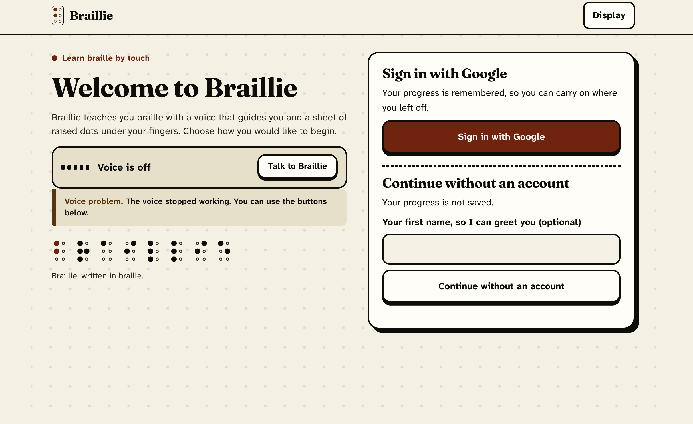
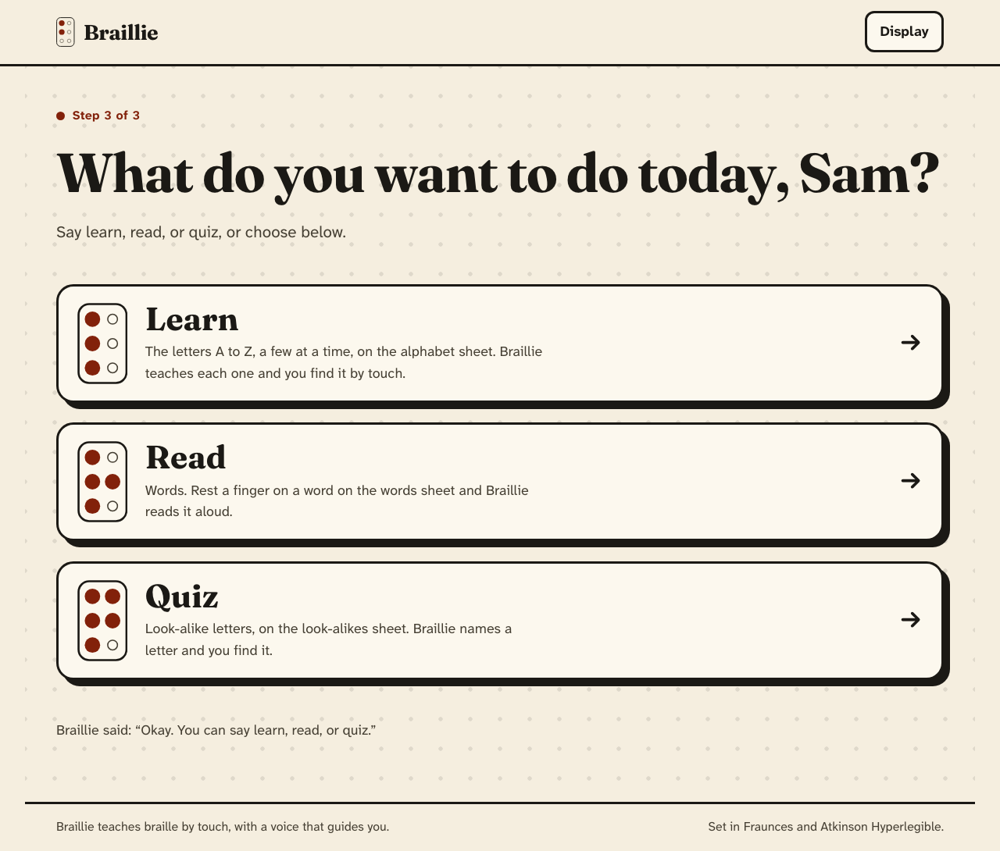
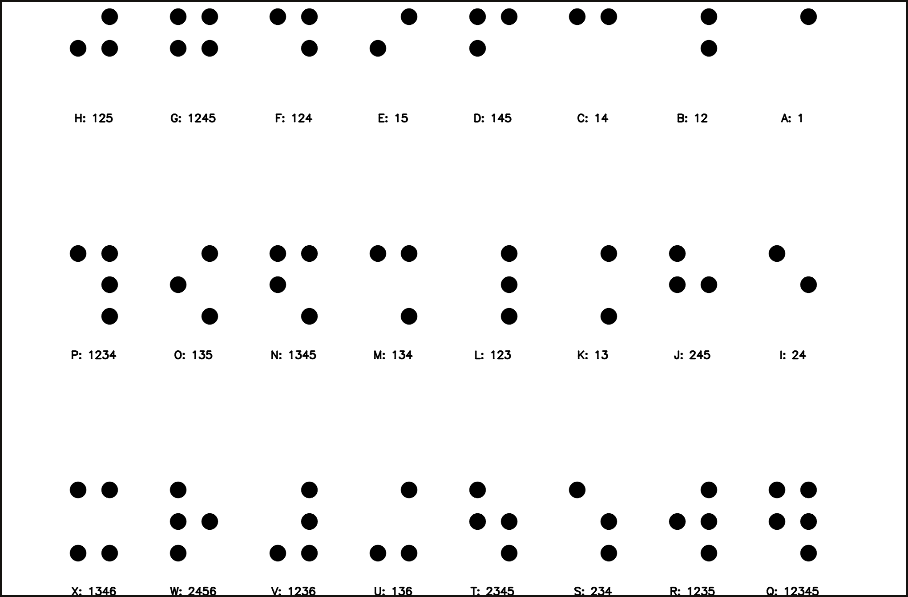
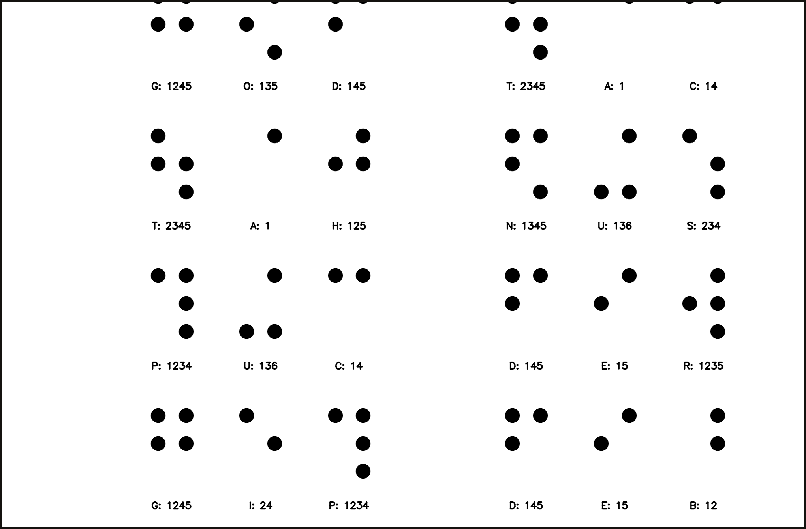
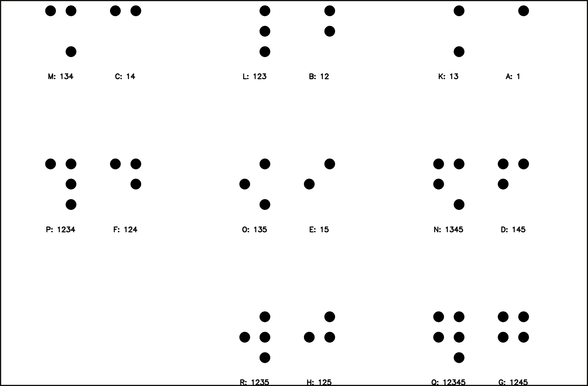
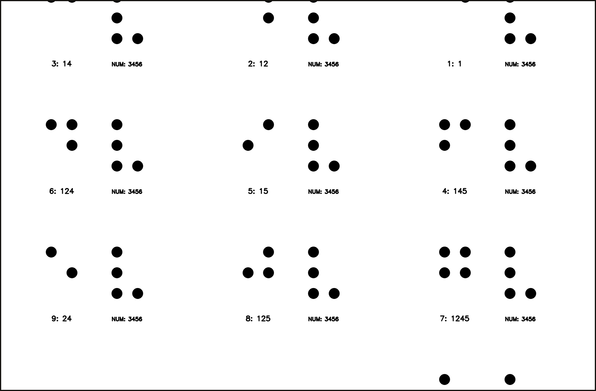

# Braillie

**Learn braille by touch, guided by a voice that can hear you too.**

Braillie watches a printed braille sheet through a camera, follows your finger, and works out which
letter you're touching — then teaches, reads or quizzes you out loud. It's built for people who can't
see the screen: sign in, connect a phone as the camera, and everything from then on can be done by voice.

<p align="center"></p>

## What it does

- **Reads a real printed braille sheet.** A camera-based detector (YOLOv8) finds every raised dot and registers the page, so it knows which cell your finger is on.
- **Three ways to practice.** **Learn** teaches the alphabet a few letters at a time; **Read** speaks a word aloud when you rest a finger on it; **Quiz** tests you on letters that look alike.
- **Talks and listens.** Deepgram gives it a voice and lets you drive the whole thing hands-off — "hint", "repeat", "next", "stop" — and it speaks up if the sheet goes out of view or it didn't catch what you said.
- **Adapts to you.** Spaced-repetition tracks which letters you find hard and which ones you keep mixing up, and practice leans toward those.
- **Ask it anything.** Say "Braillo" followed by a question — "Braillo, why is D different from B?" — for a spoken answer from an AI coach (needs an OpenAI key; the rest of the app works without one).
- **A phone is the camera.** Scan a QR code and your phone becomes Braillie's eyes, speaker and microphone — no dedicated hardware.
- **Built for blind and low-vision users.** Voice-driven sign-in, screen-reader-friendly markup, WCAG AAA colour contrast, and light / dark / high-contrast themes with adjustable text size.
- **Remembers your progress.** Google sign-in keeps it across sessions; guests are never saved, on this computer or anywhere else.

<p align="center"></p>

## Try it in a few minutes

You'll need Python 3.10+, Node 20+, a webcam or a phone, and a free [Deepgram](https://deepgram.com) API key
(it does the speaking and listening; the rest of the app runs without any other key).

```bash
git clone https://github.com/MrFiscus/Braillie.git
cd Braillie

# Python side: detection, the tutor, the phone link
python3 -m venv braille_tutor/.venv && source braille_tutor/.venv/bin/activate
pip install -r braille_tutor/requirements.txt -r requirements-voice.txt
git clone https://github.com/snoop2head/DotNeuralNet braille_tutor/third_party/DotNeuralNet

# Website
cd website-frontend && npm install && cd ..

# Your keys (never commit this file)
cp .env.example .env   # then fill in DEEPGRAM_API_KEY at minimum
```

Then, from the repo root, with the venv active:

```bash
./run_all.sh
```

This starts the tutor and the website together and opens the login flow. Visit **http://localhost:5173**,
sign in (or continue as a guest — nothing is saved for guests), scan the QR code with your phone, and choose
Learn, Read or Quiz.

No phone handy, or on a network that blocks phone ↔ laptop traffic? `./run_all.sh --phone-tunnel` routes the
phone link over a public tunnel instead (needs [`cloudflared`](https://github.com/cloudflare/cloudflared)); see
[`braille_tutor/README.md`](braille_tutor/README.md#phone-as-the-camera-scan-a-qr-code---phone-camera) for every
connection mode and what each trades off.

## Print a sheet and try it today

The four practice sheets are already generated and checked into the repo — click a thumbnail below to open and
download the full-resolution, print-ready PNG (A4, 300 DPI, print at **100% / no scaling**).

<table>
<tr>
<td align="center" width="25%">
<a href="braille_tutor/sheet/nomarkers/poke_alphabet.png"></a><br>
<b>Alphabet A–Z</b><br><sub>used by <b>Learn</b> · <a href="braille_tutor/sheet/nomarkers/poke_alphabet.png">download</a></sub>
</td>
<td align="center" width="25%">
<a href="braille_tutor/sheet/nomarkers/poke_words.png"></a><br>
<b>Words</b><br><sub>used by <b>Read</b> · <a href="braille_tutor/sheet/nomarkers/poke_words.png">download</a></sub>
</td>
<td align="center" width="25%">
<a href="braille_tutor/sheet/nomarkers/poke_lookalikes.png"></a><br>
<b>Look-alikes</b><br><sub>used by <b>Quiz</b> · <a href="braille_tutor/sheet/nomarkers/poke_lookalikes.png">download</a></sub>
</td>
<td align="center" width="25%">
<a href="braille_tutor/sheet/nomarkers/poke_numbers.png"></a><br>
<b>Numbers &amp; signs</b><br><sub>extra practice · <a href="braille_tutor/sheet/nomarkers/poke_numbers.png">download</a></sub>
</td>
</tr>
</table>

**To make a physical page:** print one at 100% scale, tape it face-down onto a corkboard, foam sheet or thick
cardboard, and poke each black dot through from the back with anything blunt (a used ballpoint pen, a knitting
needle, an unfolded paperclip). Flip it over — the raised bumps on the front are what you feel and what the
camera reads. Hold the whole page flat in front of the camera on a plain, contrasting surface.

These are the *no-markers* sheets: `./run_all.sh` already runs with `--paper`, so Braillie finds the page from
its own four edges — nothing else to print, cut out or stick on. (A version with corner registration markers
also exists in [`braille_tutor/sheet/`](braille_tutor/sheet/) for more robust tracking in tricky lighting; see
[`braille_tutor/README.md`](braille_tutor/README.md#reading-our-printed--poked-sheets-correctly---sheet) for
how to use it, plus `--mode explore` for reading a real embossed braille book page.)

## How it works

A camera (built-in webcam, or a phone linked over the local network, a trusted certificate, or a tunnel)
feeds frames to a YOLOv8 detector that finds every braille cell and its raised dots, and to a page-registration
step that maps pixels to real page millimetres. The Python tutor (`braille_tutor/tutor.py`) tracks a fingertip
against that page, decides what to say, and drives Learn/Read/Quiz. Deepgram turns that into speech and turns
your voice into commands (`voice_io.py`, root-level). The React website polls the tutor's local HTTP API for
state and shows the same camera feed, live detection boxes, and everything the tutor says — built to work
just as well with a screen reader as with sight.

## Repo layout

```
braille_tutor/        Detection (YOLOv8 + page registration), the tutor, voice-controlled lessons,
                       the phone link (QR pairing, certificates, tunnel), the local HTTP API,
                       the AI coach (llm.py), and sheet/ — the printable practice sheets above.
                       See braille_tutor/README.md (full detail) and API.md (the HTTP API).
website-frontend/     React + TypeScript + Vite site: voice-driven sign-in, phone pairing,
                       the mode picker, and the live practice screen. Talks to the tutor over HTTP.
voice_io.py            Deepgram speech in / speech out, used by the tutor.
run_all.sh              Starts the tutor and the website together (the way to run it above).
requirements-voice.txt  Root-level Python deps for voice_io.py.
backend/, run_server.py An earlier prototype (a separate WebSocket server); superseded by
                       braille_tutor/tutor_server.py + run_all.sh above and no longer used.
```

## Documentation

- [`braille_tutor/README.md`](braille_tutor/README.md) — the full technical write-up: every CLI flag and
  mode, how page registration and locking work, reading a real embossed book page, the accessibility features,
  the phone link's three connection modes, the AI coach, and known limits.
- [`braille_tutor/API.md`](braille_tutor/API.md) — the tutor's local HTTP API, for anyone building another
  frontend against it.

## Testing

```bash
cd braille_tutor && python -m unittest discover -p "test_*.py"   # 580+ tests: detection, tutor, phone link, voice
cd website-frontend && node --test "tests/*.test.mjs"            # sign-in voice, colour contrast, progress sync
```

## Team

Built at HACKMIT by **Smaran Pokharel** (braille detection, the tutor, phone pairing, the accessible
website), **Tenzing Gurung** (voice I/O, word-checking, demo-night reliability fixes), **Reagan Spurlock**
(the first version of the website), and **Sage Peterson** (the physical braille sheets, video and technical
support).

## Credits

Detection uses the pretrained YOLOv8 weights from [DotNeuralNet](https://github.com/snoop2head/DotNeuralNet)
by snoop2head (MIT License) — cloned separately, not modified. See
[`braille_tutor/README.md`](braille_tutor/README.md#credits) for the full attribution.
